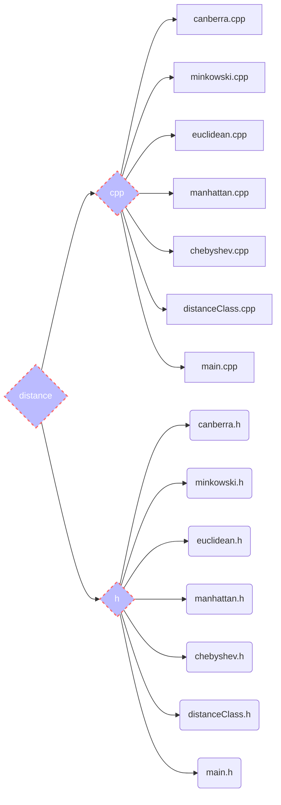

# 
Omer and Ofir Advanced programming project

# 
Advanced-Programming-1-Project

  

ㅤ

🏁🏁🏁🏁🏁🏁🏁🏁🏁🏁🏁🏁🏁🏁🏁🏁🏁🏁🏁🏁🏁🏁🏁🏁🏁🏁🏁🏁🏁🏁🏁🏁🏁🏁🏁🏁🏁🏁🏁🏁🏁🏁🏁🏁🏁🏁

ㅤ

  So far, we have uploaded the first assignment for the project.
The assignment was to make a software that calculates distances between 2 vectors of the *same size* with 5 different algorithms:

 1. **Canberra**
 2. **Minkowski**
 3. **Euclidean**
 4. **Chebyshev**
 5. **Manhattan**

This is a rundown about everything we have and did in the first assignment:

# 📁 Files

> This is a screenshot of the files we have created in the assignment.

# ⚡ Algorithms
**Euclidean**

> The distance between any two points on the real line is the absolute value of the numerical difference of their coordinates, their absolute difference. Thus if p and q are two points on the real line, then the distance between them is given by this formula, and the same for *n* number of points.

**Manhattan**

>The taxicab distance, *d1*, between two vectors **p** , **q** in an *n*-dimensional real vector space with fixed Cartesian coordinate system, is the sum of the lengths of the projections of the line segment between the points onto the coordinate axes.

**Chebyshev**

>Mathematically, the Chebyshev distance is a metric induced by the supremum norm or uniform norm. It is an example of an injective metric. In two dimensions, i.e. plane geometry, if the points **p** and **q** have Cartesian coordinates (*x~1~*,*y~1~*) and (*x~2~*,*y~2~*), their Chebyshev distance is the maximum distance between the *x*'s and the *y*'s of the two vectors.

**Canberra**

>The Canberra distance *d* between vectors **p** and **q** in an *n*-dimensional real vector space is given by summing up the absolute values of *p~i~*-*q~i~*, and dividing it by *p~i~*+*q~i~*.

**Minkowski**

>For **p≥1**, the Minkowski distance is a metric as a result of the Minkowski inequality. When **p<1**, the distance between **(0,0)** and **(1,1)** is **2^1/p^>2** but the point **(0,1)** is at a distance **1** from both of these points. Since this violates the triangle inequality, for **p>1** it is not a metric. However, a metric can be obtained for these values by simply removing the exponent of **1/p**.

## 💻 How to run the program
The whole program runs from the **main.cpp** file.

To debug the project, you need to download **MakeFile** version *3.22*.

[CMake download for Linux and Windows](https://cmake.org/files/v3.2/)

Then go to the directory of the project (on the terminal), and write:

    cmake ..

Lastly, go to the cmake directory from the terminal, and then write the following command:

    ./Advanced_Programming_1_Project

**Linux:**

instead of the cmake, you can also paste this line in the terminal *(might not work)*:

    g++ -std=c++11 -Idistance/h distance/h/canberra.h distance/cpp/canberra.cpp distance/h/chebyshev.h distance/cpp/chebyshev.cpp distance/h/euclidean.h distance/cpp/euclidean.cpp distance/h/manhattan.h distance/cpp/manhattan.cpp distance/cpp/minkowski.cpp distance/h/minkowski.h distance/h/distanceClass.h distance/cpp/distanceClass.cpp distance/h/main.h distance/cpp/main.cpp

and then:

    ./a.out

## ✍ Examples for input

The program is coded to accept many kind of incorrect input, and the rest of the input is being thrown out with an error message, but it is still possible to **re-input** the vectors after making a mistake.
Here are some examples for input:

|                |Input							 |Error message|
|----------------|-------------------------------|-----------------------------|
|Double (or more) spaces   |`5ㅤ 5`               |**no error**, the vector is: 5 5|
|Spaces at the end or beggining|`5 5ㅤ`            |**no error**, the vector is: 5 5            |
|Chars          |`5g y6.7`|**error message:** The input was not a number.|
|Double dots| `5.5.5 6`|**error message:** The input was not a number.|
|Different size vectors|`First vector: 5 5`ㅤㅤㅤ `Second vector: 6 6 6`| **error message:** The vectors aren't the same size

## 📊 UML diagrams

**Dictionary:** 

This is a UML diagram of the current Classes and Packages:

