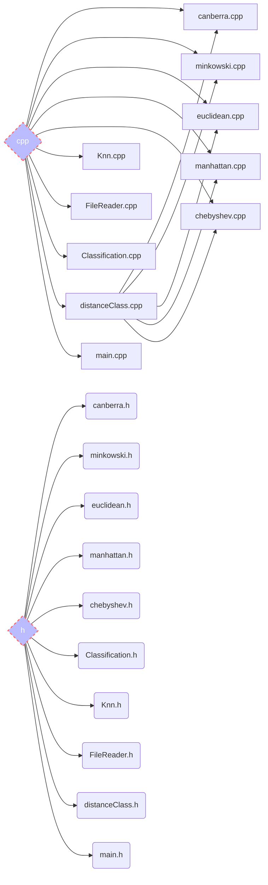

# 
Omer and Ofir Advanced programming project

# 
Advanced-Programming-1-Project

  

ㅤ

🏁🏁🏁🏁🏁🏁🏁🏁🏁🏁🏁🏁🏁🏁🏁🏁🏁🏁🏁🏁🏁🏁🏁🏁🏁🏁🏁🏁🏁🏁🏁🏁🏁🏁🏁🏁🏁🏁🏁🏁🏁🏁🏁🏁🏁🏁

ㅤ

  So far, we have uploaded the first and the second assignments for the project.
The first assignment was to make a software that calculates distances between 2 vectors of the *same size* with 5 different algorithms:

 1. **Canberra**
 2. **Minkowski**
 3. **Euclidean**
 4. **Chebyshev**
 5. **Manhattan**

The second assignment was to make a software that reads CSV files and convert them to a structure, then calculate the nearest neighbors by k value and return the class with most appearences. 
firstly we made a read file class that can read CSV files and convert them into vectors,
then, we made KNN class that uses the KNN algorithm and by getting vectors as data and a test vector, returns the chosen class.
lastly we made classification class that combines the two classes above and by using the data from the debug command and the vectors from the user returns the chosen class for this vector and this CSV file.

This is a rundown about everything we have and did in the project:

# ⚡ Algorithms

### Distance Algorithms

**Euclidean**

> The distance between any two points on the real line is the absolute value of the numerical difference of their coordinates, their absolute difference. Thus if p and q are two points on the real line, then the distance between them is given by this formula, and the same for *n* number of points.

**Manhattan**

>The taxicab distance, *d1*, between two vectors **p** , **q** in an *n*-dimensional real vector space with fixed Cartesian coordinate system, is the sum of the lengths of the projections of the line segment between the points onto the coordinate axes.

**Chebyshev**

>Mathematically, the Chebyshev distance is a metric induced by the supremum norm or uniform norm. It is an example of an injective metric. In two dimensions, i.e. plane geometry, if the points **p** and **q** have Cartesian coordinates (*x1*,*y1*) and (*x2*,*y2*), their Chebyshev distance is the maximum distance between the *x*'s and the *y*'s of the two vectors.

**Canberra**

>The Canberra distance *d* between vectors **p** and **q** in an *n*-dimensional real vector space is given by summing up the absolute values of *pi*-*qi*, and dividing it by *pi*+*qi*.

**Minkowski**

>For **p≥1**, the Minkowski distance is a metric as a result of the Minkowski inequality. When **p<1**, the distance between **(0,0)** and **(1,1)** is **21/p>2** but the point **(0,1)** is at a distance **1** from both of these points. Since this violates the triangle inequality, for **p>1** it is not a metric. However, a metric can be obtained for these values by simply removing the exponent of **1/p**.
>
>
### KNN Algorithm
KNN algorithm in the case of vectors works by finding the K data points that are closest to the new data point, using a distance measure such as Euclidean distance, and then using those K data points to determine the class label.

## 💻 How to run the program
**Linux:**

Paste this command to the terminal:

    make
Than paste this command to the terminal:

    ./a.out [number k] [path to the csv files] [type of distance algorithm]
❤️ **insert [number k] that represents the number of neighbors by which you would like to check** ❤️

❤️ **insert [path to the csv files] your own path on the computer to the csv files .** ❤️

❤️ **insert [type of distance algorithm]  like this:** ❤️

|Algorithm name  |[Type of distance algorithm]|
|----------------|----------------------------|
|Manhattan       |MAN                         |
|Euclidean       |AUC                         |         
|Chebyshev       |CHB                         | 
|Canberra        |CAN                         |
|Minkowski       |MIN                         |ㅤㅤㅤ

## ✍ Examples for input

The program is coded to accept many kind of incorrect input, and the rest of the input is being thrown out with an error message, but it is still possible to **re-input** the vectors after making a mistake.
Here are some examples for input:

|                |Input							 |Error message|
|----------------|-------------------------------|-----------------------------|
|Double (or more) spaces   |`5ㅤ 5`               |**no error**, the vector is: 5 5|
|Spaces at the end or beggining|`5 5ㅤ`            |**no error**, the vector is: 5 5            |
|Chars          |`5g y6.7`|**error message:** The input was not a number.|
|Double dots| `5.5.5 6`|**error message:** The input was not a number.|
|Different size vectors|`First vector: 5 5`ㅤㅤㅤ `Second vector: 6 6 6`| **error message:** The vectors aren't the same size

## 📁 Files

**Dictionary:** 

This is a UML diagram of the current Classes and Packages:

