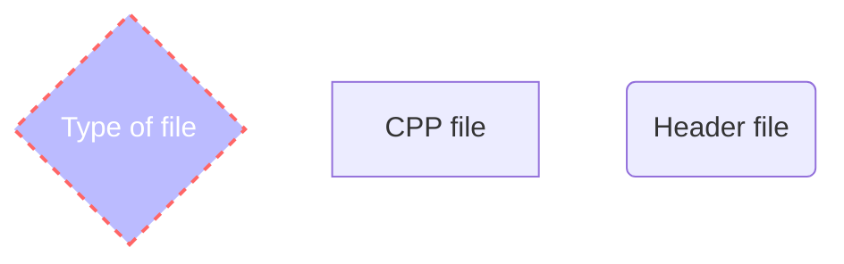

# 
Omer and Ofir Advanced programming project

# 
Advanced-Programming-1-Project

  

ㅤ

🏁🏁🏁🏁🏁🏁🏁🏁🏁🏁🏁🏁🏁🏁🏁🏁🏁🏁🏁🏁🏁🏁🏁🏁🏁🏁🏁🏁🏁🏁🏁🏁🏁🏁🏁🏁🏁🏁🏁🏁🏁🏁🏁🏁🏁🏁

ㅤ

  So far, we have uploaded the first and the second assignments for the project.
The first assignment was to make a software that calculates distances between 2 vectors of the same size with 5 different algorithms:

 1. *Canberra*
 2. *Minkowski*
 3. *Euclidean*
 4. *Chebyshev*
 5. *Manhattan*

The second assignment was to make a software that reads CSV files and convert them to a structure, then calculate the nearest neighbors by k value and return the class with most appearences. 
firstly we made a read file class that can read CSV files and convert them into vectors,
then, we made KNN class that uses the KNN algorithm and by getting vectors as data and a test vector, returns the chosen class.
lastly we made classification class that combines the two classes above and by using the data from the debug command and the vectors from the user returns the chosen class for this vector and this CSV file.

The third assignment was to create a server and a client that talks to one another. we created a server with his own main, and a client with his own main, where whenever you write the make command, the makefile knows to make a server.out and a client.out files with different mains.

The fourth assigment was to create realization so the server would be able to talk with several clients at the same time. In addition, the server will print a menu for the user with several options as detailed later in the file

This is a rundown about everything we have and did in the project:

# ⚡ Algorithms

### Distance Algorithms

*Euclidean*

> The distance between any two points on the real line is the absolute value of the numerical difference of their coordinates, their absolute difference. Thus if p and q are two points on the real line, then the distance between them is given by this formula, and the same for n number of points.

*Manhattan*

>The taxicab distance, d1, between two vectors *p* , *q* in an n-dimensional real vector space with fixed Cartesian coordinate system, is the sum of the lengths of the projections of the line segment between the points onto the coordinate axes.

*Chebyshev*

>Mathematically, the Chebyshev distance is a metric induced by the supremum norm or uniform norm. It is an example of an injective metric. In two dimensions, i.e. plane geometry, if the points *p* and *q* have Cartesian coordinates (x1,y1) and (x2,y2), their Chebyshev distance is the maximum distance between the x's and the y's of the two vectors.

*Canberra*

>The Canberra distance d between vectors *p* and *q* in an n-dimensional real vector space is given by summing up the absolute values of pi-qi, and dividing it by pi+qi.

*Minkowski*

>For *p≥1, the Minkowski distance is a metric as a result of the Minkowski inequality. When **p<1, the distance between *(0,0)* and *(1,1)* is **21/p>2* but the point *(0,1)* is at a distance *1* from both of these points. Since this violates the triangle inequality, for *p>1* it is not a metric. However, a metric can be obtained for these values by simply removing the exponent of *1/p*.
>
>
### KNN Algorithm
KNN algorithm in the case of vectors works by finding the K data points that are closest to the new data point, using a distance measure such as Euclidean distance, and then using those K data points to determine the class label.

## 💻 How to run the program
*Linux:*

Paste this command to the terminal:

    make
Than paste this command to the terminal:

*Server:*

    ./server.out [port number]
    
*Client:*
    
    ./client.out [ip of the server] [port number]
    
   **insert [port number] that represents the port number of the server**
   **insert [ip of the server]  as the ip of the computer who opened the server**
ㅤㅤ

## ✍ User menu

When a new user connects to the server, first the server will print the following options menu:
1. upload an unclassified csv data file
2. algorithm settings
3. classify data
4. display results
5. download results
8. exit

 **if the user press 1 + Enter:** 
first he will receive a message "please upload your local train CSV file." and will have to enter a path to his local train CSV file, which is the classified file.
If the upload fails, the user will receive an error message and return to the main menu,
else, he will receive a message "upload complete. please upload your local test CSV file." and will have to enter a path to his local test CSV file, which is the unclassified file.
If the upload fails, the user will receive an error message and return to the main menu,
else, he will receive a message "upload complete" and return to the main menu.

 **if the user press 2 + Enter:**
the current K and distance metric will be shown to the user, the default K and metric is k = 5, metric = AUC.
Than the user will be given the option to enter a new K value and metric value that will be updated after pressing another enter. 
If the user pressed Enter immediately after displaying the current K value and metric value and did not enter a new K value and metric value, the current values ​​will not change.
 The format for inserting new K and metric is [K metric] where K must be a positive number and the metric must be as described below
|Algorithm name  |[Type of distance algorithm]|
|----------------|----------------------------|
|Manhattan       |MAN                         |
|Euclidean       |AUC                         |
|Chebyshev       |CHB                         |
|Canberra        |CAN                         |
|Minkowski       |MIN                         |

if the user entered an invalid value for K, "invalid value for k" message will be printed 
if the user entered an invalid value for metric, "invalid value for metric" message will be printed 
if the user entered an invalid input for bouth K and metric, "invalid value for k and invalid value for metric" message will be printed 

 **if the user press 3 + Enter:**
The test file will be classified according to the train file and the classified information will be saved on the server.
If the classification was successful, "classifiyng data complete" message will be printed to the user.
if the user never pressed 1 and never upload files, "please upload data" message will be printed to the user.

 **if the user press 4 + Enter:**
 The server will return the list of classifications and it will be printed to the user in the following format: 
 1 A
 2 B
 3 C
 4 A
Done. 
where A B C are the classification classes and at the end "Done." will be printed.
if the user never upload Train and Test files, "please upload data" message will be printed
if the user never classify the data, "please classify data" message will be printed

 **if the user press 5 + Enter:**
 Similar behavior to that of option 4, only that instead of printing the results, the user will enter a path to create local CSV file and there the client will save the results in exactly the same format without "Done." at the end.
 ❤️ pay attention ❤️
Immediately after entering the path and pressing enter, the menu will be reprinted and the user will be able to send additional commands immediately, even if the file download has not yet finished because the file download is done in a separate thread.

 **if the user press 8 + Enter:**
The interaction between the server and the client will end.

 **any other option:**
 "wrong input" message will be printed and the user will return to main menu
 
## 📁 Files

**Dictionary:** 

This is a UML diagram of the current Classes and Packages:

